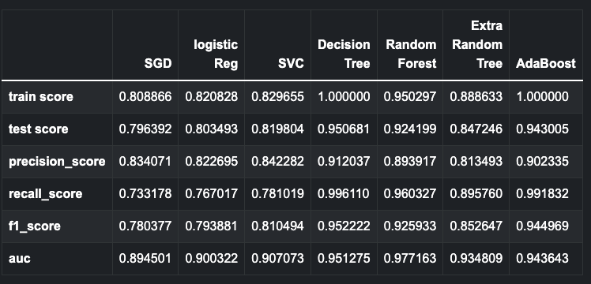
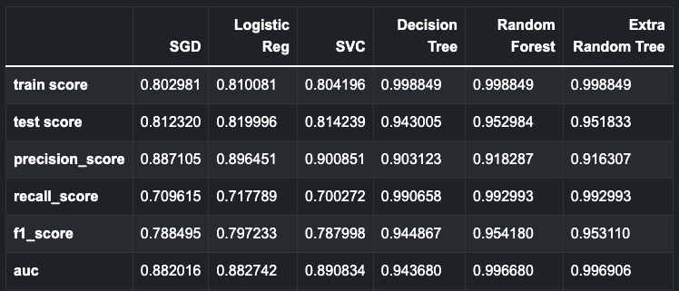
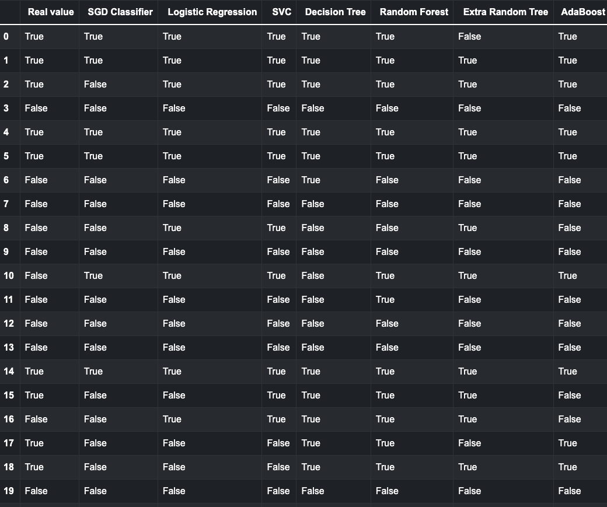
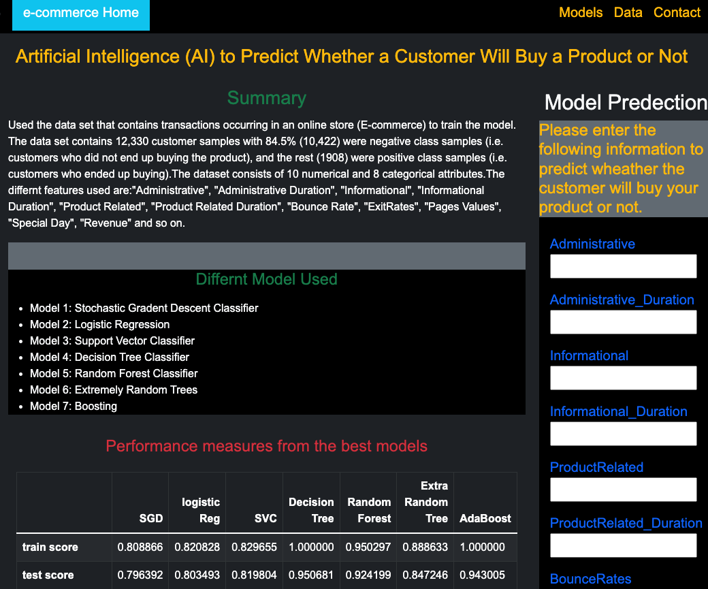

# e-commerce
The website is deployed to Heroku at: https://online-customers.herokuapp.com/

In this project, I built a machine learning model that attempts to predict whether a customer will buy the product or not

## Background
Used the data set that contains transactions occurring in an online store (E-commerce) to train the model. The data set contains 12,330 customer samples with 84.5% (10,422) were negative class samples (i.e. customers who did not end up buying the product), and the rest (1908) were positive class samples (i.e. customers who ended up buying).The dataset consists of 10 numerical and 8 categorical attributes.The differnt features used are:"Administrative", "Administrative Duration", "Informational", "Informational Duration", "Product Related", "Product Related Duration", "Bounce Rate", "ExitRates", "Pages Values", "Special Day", "Revenue" and so on.

## Data Structure
 This data set contains transactions occurring in an online store (E-commerce)

- Out of the 12,330 customer samples in the dataset, 84.5% (10,422) were negative class samples (i.e. customers who did not end up buying the product), and the rest (1908) were positive class samples (i.e. customers who ended up buying).

- The dataset consists of 10 numerical and 8 categorical attributes.

- The 'Revenue' attribute can be used as the class label.

## Data cleaning
After downloading the data, I needed to clean it up so that it was usable for our model. I made the following changes using pandas:

* Choosing a cutoff value and create a list of to be replaced for different categorical columns
* Combined related numerical columns to one
* Converted the target column values to positive and negative class rows
* Selected only positive and negative calss rows
* Created  and saved under-sampling data for modeling
* Created  and saved over-sampling data for modeling

## Data visulization

## Under Sampling and Over Sampling
In the original dataset, only 10% of customers buy the product. To get a truly accurate model, special techniques were used on imbalanced data.
1. Undersampling: These data have been undersampled to give an even number of positive and negative class using undersampling techniques.
2. Oversampling: Oversampling and SMOTE (Synthetic Minority Over-sampling ) technique is used to give an even number of positive and negative class.  

## Preprocessing: 
### Scaling the data
Used `StandardScaler` to scale the training and testing sets. 
### Converting categorical data to numeric
Created a training set from the 2019 loans using `pd.get_dummies()` to convert the categorical data to numeric columns. Similarly, create a testing set from the 2020 loans, also using `pd.get_dummies()`

## Model Building
Created different classification models on this data. Different models are:
* Logistic Regression
* KNeighbors Classifier
* Support Vector Classifier
* Decision Tree Classifier
* Random Forest Classifier
* Extremely Random Trees
* Boosting- AdaBoostClassifier

## Tuning hyperparamaters for all model
* Grid Search CV
* Randomized Search CV

## Trying to improve score by selecting important features 
Using SelectFromModel to fit the Adaboster Classifier model and get the important features only to fit all the model desceribed above.

## Model Performance

### Model Performance after selecting only important features

## Comparing real and predicted value using sample test set

## Productionization
Used Flask templating to create a new HTML page that predict wether customer will buy the product or not using  best model. The model was saved using pickle.

Created a different route that take the user input and predict as well as other information.

The website is deployed to Heroku at: https://pred-credit-risk.herokuapp.com/

